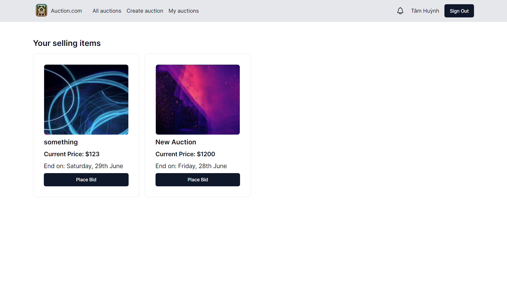

# Fullstack Auction App: Next.js, Drizzle, PostgreSQL, Tailwind, Cloudflare R2, Knock

## Getting Started

```js
# Database
DATABASE_URL=""

# Auth
AUTH_SECRET=""
AUTH_GOOGLE_ID=""
AUTH_GOOGLE_SECRET=""
NODE_ENV=""

# Knock
KNOCK_SECRET=""

# Cloudflare
ACCESS_KEY_ID=""
SECRET_ACCESS_KEY=""
ACCOUNT_ID=""
BUCKET_NAME=""

# Public
NEXT_PUBLIC_BUCKET_URL=""
NEXT_PUBLIC_KNOCK_PUBLIC_API_KEY=""
NEXT_PUBLIC_KNOCK_FEED_ID=""
```
### Features:
- Create an auction, bid on an auction, and automatically close the auction
- Loading/empty state
- Cloudflare R2 for image storage
- Knock for bid notifications (when someone outbids you)

### Demo images:



